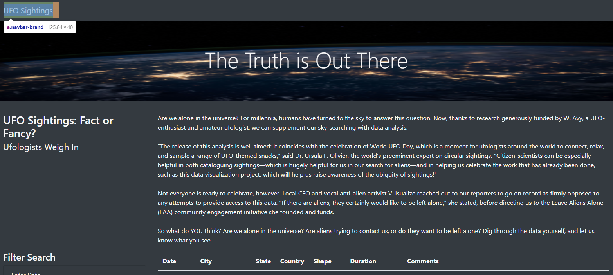

# UFOs

## Overview of the UFO Sightings Project

The request from a client was to display a table organizing UFO data. The client wanted the ability to filter by multiple criteria; creating a dynamic webpage that accepts user inputs and adjusts the displayed data accordingly. The table was created using JavaScript, while HTML/CSS and Bootstrap were used to enhance the aesthetics of the webpage.

[UFOs](index.html)

## Resources
- Data Source: data.js
- Software: Python 3.9.6, JavaScript 1.7, HTML 5, CSS/Bootstrap 4.0.0

## Results

### Search Criteria Procedure

####Index page

This is the initial page. The user can re-initialize the page by clicking on the navigation bar at the top.

####Filter search

The user can enter a specific date, city, state, country, and/or UFO shape in the search criteria. Once the criteria is entered the user can hit the <Tab> key or otherwise navigate away from the search bar and the table will identify the change and filter the table accordingly. The user can enter any of the filter parameters simultaneously. 

## Summary

The table is successful at displaying the desired information dynamically, but one drawback of this design is the filter parameter has to be formatted in a specific way in order to function. There is a default entry for each filter parameter in order to show the required format, but this still leaves room for user input error. For example, if the date is entered in a different format, or if any of the other filter parameters are entered with a capital letter, then the table will not be displayed as desired. 

###Recomendations

1. The first recommendation of improvement would be to address the previously stated drawback. We could add function in the code to catch common inconsistencies in the user’s search parameter, and convert the input into the required format. This could be easily implemented to address entries with capital letters, different spacing, and more in order to reduce user input errors. 
2. The next recommendations for further development of the webpage would be to enhance the date filter. We could alter the search filter to allow for a date range to be entered, instead of only a specific date. This would allow the user to search for UFO sightings within a given period of time.

